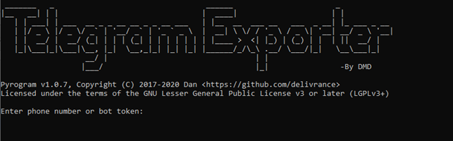

# Telegram Exporter

Telegram Exporter is a forensics tool to extract all chats of a given Telegram account!
The account to analyze must be connected to a phone number.

## Prerequisites
All the applications required for Telegram Exporter to work are declared in the "requirements.txt" file. 
The Python version, on the other hand, must be greater than or equal to "3.0.0".
The installation of these applications is automatic:
- Windows systems: launch the "startup.ps1" file (requires the "Windows Powershell" shell), which will check for the presence of any version of Python and, if it matches the one declared in the "requirements.txt" file, proceeds with the installation of all the remaining required applications
- Linux systems: in most Linux distributions Python is already pre-installed; consequently, it is sufficient to run the command "pip3 install -r requirements.txt" from the terminal.

## Configuration of the "config.ini" file
For the first boot, you need to compile the "config.ini" file properly.
To do this, you need to login on "https://my.telegram.org/auth?to=apps", entering your cell phone number (not the one of the Telegram account to analyze). 
After that, you'll receive a code on Telegram to enter to authenticate.
After authenticating, you must create a new application, to which you must associate a name; Telegram will take care of generating, instead, the values "api_id" and "api_hash".
Once these values are obtained, you will have to insert them in the "config.ini" file instead of the dummy values inserted by default.
After that, you can start the "run.cmd" (for Windows systems) or "run.sh" (for Linux systems).

## First boot
At the first startup, you will be asked to enter the phone number (including area code, for example: +39 for numbers registered in Italy) associated with the account from which you want to perform the extraction.

 
After entering it and pressing "Enter", you will be asked to enter a numeric PIN; this PIN will be sent by the "Telegram" user via message.
 
If two-factor authentication is enabled, you will also be prompted to enter the password to access the user's cloud.
 
Once the password is entered, the first startup will be completed and the application will be ready to perform extractions. Being the first startup, entering "y" or "N" will not result in any file deletion.

## "configuration.json" file configuration
The "configuration.ini" file is intended for the contextual configuration of the application operation.
At the moment, it has only one parameter, named "export_media". If it has value 1, then all media retrieved from chats will be downloaded; if it has value 0, they won't be downloaded (in any case, in extracted chats there will be a trace of when the media was sent/received).

## Core Team

- [Domenico Gigante](https://github.com/Domy976)
- [Domenico Picerno](https://github.com/Davaaam)
- [Mirko De Vincentiis](https://github.com/TheF3n1x)